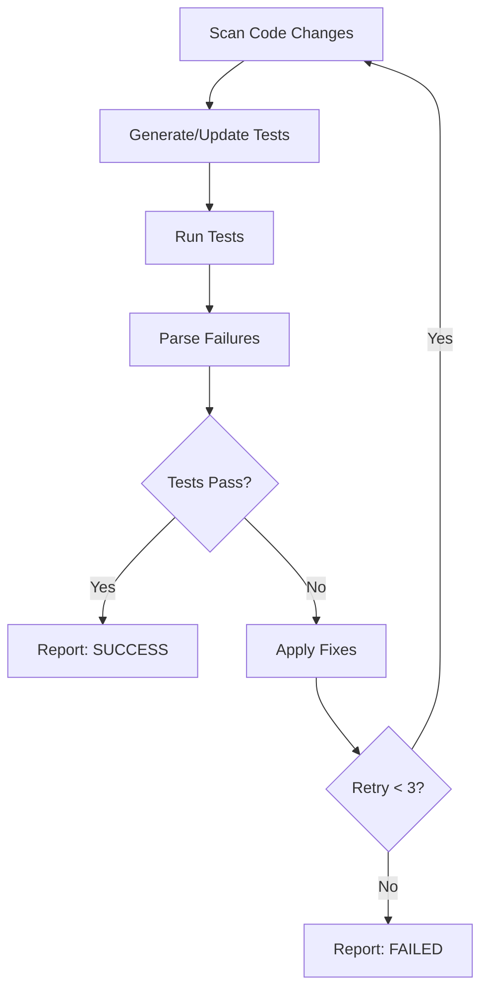

# Workflow PoC v1

Automated development workflow that scans code, generates tests, runs them, detects failures, applies simple fixes, and retries — all without human intervention.

## Workflow Concept

This PoC demonstrates a **closed-loop test-fix cycle**: source code is scanned, tests are generated for untested modules, tests are executed, failures are parsed, simple fixes are applied automatically, and the cycle repeats until tests pass or the retry limit is reached.

The goal is to reduce the feedback loop between writing code and having passing tests, catching common mistakes like arithmetic bugs, import errors, and boundary conditions.

## Architecture

The system is built as a **pipeline of composable steps**, each implemented as a pure-ish function that takes a `WorkflowState` and returns an updated state. The runner orchestrates step execution, retry logic, and logging.

```
┌─────────────────────────────────────────────────────┐
│                   Runner (CLI)                       │
│  Loads workflow.yaml → Executes steps → Manages retry│
├─────────────────────────────────────────────────────┤
│  Steps:                                              │
│    scanChanges → generateTests → runTests →          │
│    parseFailures → applyFixes → report               │
├─────────────────────────────────────────────────────┤
│  Utils: logger, shell, parser                        │
└─────────────────────────────────────────────────────┘
```

## Workflow Diagram



## Step-by-Step Workflow Explanation

### 1. Scan Code Changes (`scanChanges.ts`)
Recursively scans the target project's `src/` directory for `.ts` files (excluding test files). In a production version, this would use `git diff` to detect only changed files.

### 2. Generate or Update Tests (`generateTests.ts`)
For each scanned source file, checks if a corresponding test file exists in `tests/`. If missing, generates a test skeleton by:
- Parsing exported function names from the source
- Creating `describe`/`it` blocks with basic assertions
- Writing the generated test file

### 3. Run Tests (`runTests.ts`)
Executes `npx vitest run` in the target project directory and captures stdout, stderr, and exit code. The full output is stored in workflow state for parsing.

### 4. Parse Failures (`parseFailures.ts`)
Analyzes vitest output to extract structured failure information:
- Which test file failed
- The test name
- The error message
- The likely source file

### 5. Apply Simple Fixes (`applyFixes.ts`)
Attempts automated repairs for common issues:
- **Arithmetic bugs**: Detects wrong operators (e.g., `-` instead of `+`) in math-related files
- **Boundary conditions**: Fixes off-by-one errors in comparisons
- **Import paths**: Corrects missing `.js` extensions in import statements

### 6. Report (`report.ts`)
Generates a summary including:
- Pass/fail status
- Number of retries used
- Files scanned and tests generated
- List of applied fixes
- Any remaining failures

## Repository Structure

```
workflow-poc/
├── README.md
├── package.json
├── tsconfig.json
├── workflow.yaml              # Workflow configuration
├── src/
│   ├── runner.ts              # CLI entry point & orchestrator
│   ├── types.ts               # TypeScript type definitions
│   ├── steps/
│   │   ├── scanChanges.ts     # Step 1: File scanning
│   │   ├── generateTests.ts   # Step 2: Test generation
│   │   ├── runTests.ts        # Step 3: Test execution
│   │   ├── parseFailures.ts   # Step 4: Failure parsing
│   │   ├── applyFixes.ts      # Step 5: Auto-fix
│   │   └── report.ts          # Step 6: Report generation
│   └── utils/
│       ├── logger.ts          # Structured logging
│       ├── shell.ts           # Shell command execution
│       └── parser.ts          # Test output parser
├── examples/
│   └── sample-app/            # Demo project with intentional bug
│       ├── package.json
│       ├── vitest.config.ts
│       ├── src/
│       │   ├── math.ts        # Has bug: add() uses subtraction
│       │   └── strings.ts     # String utilities (no test yet)
│       └── tests/
│           └── math.test.ts   # Tests that will fail due to bug
└── logs/
    └── workflow.log           # Generated during execution
```

## How to Run the Workflow

```bash
# 1. Install dependencies
cd workflow-poc
npm install

# 2. Install sample app dependencies
cd examples/sample-app
npm install
cd ../..

# 3. Run the workflow
npm run workflow
```

## Example Execution

Expected behavior when running the workflow:

**Attempt 1:**
1. Scans `examples/sample-app/src/` → finds `math.ts`, `strings.ts`
2. No test for `strings.ts` → generates `tests/strings.test.ts`
3. Runs vitest → `math.test.ts` fails (`add(2,3)` returns `-1` instead of `5`)
4. Parses failure → identifies `math.ts` arithmetic bug
5. Applies fix → changes `return a - b` to `return a + b`

**Attempt 2:**
1. Rescans files
2. Tests already exist
3. Runs vitest → all tests pass
4. Reports SUCCESS

## Logs and Retry Behavior

Every step writes structured JSON to `logs/workflow.log`:

```json
{
  "timestamp": "2024-01-15T10:30:00.000Z",
  "stepName": "apply_simple_fixes",
  "commandOutput": "Applied 1 fix(es): Fixed arithmetic operator in math.ts",
  "errors": [],
  "appliedFixes": ["Fixed arithmetic operator in examples/sample-app/src/math.ts"],
  "retryCount": 0
}
```

The runner retries the full scan→test→fix cycle up to 3 times (configurable in `workflow.yaml`). Each retry gets a fresh scan so new fixes are picked up.

## Limitations

- **Fix scope**: Only handles simple, pattern-based fixes (arithmetic operators, imports, boundary conditions). Cannot reason about complex logic errors.
- **Test generation**: Generated test skeletons only assert function existence. Real test logic requires human input or an LLM.
- **Parser**: The vitest output parser uses regex heuristics and may miss some failure patterns.
- **Single project**: Currently targets a single `targetDir`. Multi-project support would need orchestration.
- **No git integration**: Scans all files rather than only changed files.

## Future Improvements

- **Git diff integration**: Scan only files changed since last commit
- **LLM-powered fixes**: Use an AI model to understand and fix complex logic errors
- **LLM-powered test generation**: Generate meaningful test cases, not just skeletons
- **Mobile E2E testing**: Extend workflow to trigger Detox/Appium test suites
- **Web E2E testing**: Integrate Playwright/Cypress test execution
- **CI/CD integration**: Run as a GitHub Action or CI pipeline step
- **Watch mode**: Continuously monitor file changes and re-run workflow
- **Configurable fix strategies**: Plugin system for custom fix patterns
- **Multi-language support**: Extend beyond TypeScript to Python, Go, etc.
